# 基于 Vue 的城乡居民大病保险管理系统

---


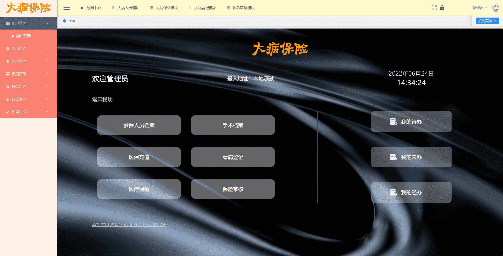

唠嗑几句，本项目是一个基于 **Vue** 和 **SpringBoot** 的城乡居民大病保险管理系统，模拟了就医和医保报销的过程，主要包含以下五大模块。

- 系统数据中心
- 系统参保管理
- 大病保险管理
- 大病登记管理
- 保险审核管理

---
## 更新日志

V2.0.0 2022-06-24

- 更新产品 UI 界面。
- 新增个人门户常用模块功能。
- 支持企业微信扫码登陆。
- 修复一些 BUG，将数字字段从 String 调整为 BigDecimal ，并保留两位小数。

V1.1.0 2022-03-05

- 新增医疗设备出入库模块，含设备/耗材档案维护、入库、领用出库功能。

V1.0.2 2022-01-31

- 因服务器迁移，修改首页图片/依赖 JS 的远程地址。
- 优化后端项目结构。

V1.0.1 2022-01-01

- 前后端依赖更新并适配。
- 编写项目说明文档。

---

## 技术栈

- 前端：Vue2.6.14、View UI4.7（组件库）
- 后端：SpringBoot2.7.0、MybatisPlus3.5.2(后端连数据库)、SpringSecurity（系统认证、授权）
- 数据库：MySql8.0.29、Redis5（缓存）

---

## 作者有话说

- 作者会对本仓库进行不定期更新，若有问题可通过 Issue 留言，代码全部开源，系统安装配置运行方面的问题，提供免费答疑。
- 可有偿提供各类文档、一对一远程语音教学，支持在此基础上继续定制开发，或定制任何基于 Vue 和 SpringBoot 的管理系统。
- 寻求一切有价值的合法商业合作，如有需求欢迎联系 Q 916077357。
- 本项目遵循 GPL-3.0 开源协议，引用本项目请注意项目上层依赖和所引用代码的许可情况，作者已申请软件著作权（登记号 2022SR0097400)，拥有本软件构建后的应用系统全部内容所有权及独立的知识产权，软件著作权证书如下所示。


---

## 业务逻辑

核心业务：

1. 人病保险补偿费用管理
2. 大病保险补偿基金管理
3. 大病保险业务的监督管理

本系统用于对大病患者的手术费用进行保险报销，模拟了参保人员就医后费用报销的流程，对参保人员进行存档管理，对病人就医后的费用 和 报销比例自动核算，对社保卡的余额自助充值，将报销数据自动转发给保险公司审核。

系统运行的流程，就是大病患者有医保卡，卡里有钱，拿着医保卡去医院就医，自费部分直接扣卡里的钱，医保报销部分由医院垫付；保险公司审核通过后，医保报销部分再转给医院，如果不通过，再扣医保卡里的余额。

本系统使用对象有三个，分别是 **医院医生**、**保险公司** 以及 **系统管理员**

- 医院医生：主要负责对 就医患者 进行看病登记
- 保险公司：主要负责发布医保信息、维护参保人员档案，设置各类手术的报销比例、医保报销审核
- 系统管理员：主要负责医保卡充值、对医院医生和保险公司业务员的登入账号、角色、权限进行配置，系统操作日志、维护数据字典


---

## 登陆界面

进入系统，首先看到登入界面，用户可以输入自己的账号、密码，进行登入操作。

登陆页面包含账号密码和手机号码两个选择来进行登录。输入账号、密码和验证码后点击登陆，即可登陆系统，此处账号密码不能为空，如果

密码输入错误，系统将进行密码错误提示，不能登陆系统，如果验证码过期，则需要重新获取验证。

此系统用于三类人群进行登陆、使用，分别是管理员、医生、保险审核员。

首先是管理员，对医保卡进行充值、对医院医生和保险公司业务员的账号、角色、权限进行配置是他的主要职责。此外可以操作日志，对数据字典进行维护；医院医生最主要职责就是对就医的患者进行看病登记；保险审核员则是发布医保信息，对参保人员的档案进行维护，各类手术的报销比例由他们来规定，以及医保报销审核通过与否由审核员决定。


用户也可以选择使用企业微信扫码方式进行登陆系统。（需要自行配置企业微信的 ID 和秘钥）


如果用户没有输入账号、密码或验证码，点击登陆按钮，系统会给与提示。


如果用户账号密码填写错误，系统给与提示，直到输入正确通过系统效验。


如果用户输入错误的验证码，系统也会给与提示，要求重新输入


## 首页

登入成功后，进入到系统的首页，顶部是系统的标题栏，用于显示系统“大病保险”的图标和一级菜单，左侧是二级、三级菜单栏，用于存放用户拥有权限的菜单列表，右下角为主区域，存放了带背景图的系统首页。


原首页（即图片滚动页面，在 V2.0.0 版本中移动至原首页模块（文件管理-原首页），如下图所示。

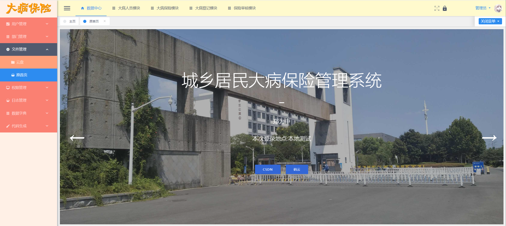

可以点击左侧滑动的按钮，进行切换图片操作

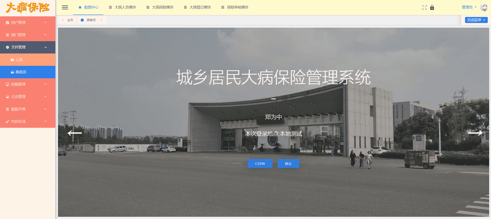

本系统使用了当下热门的 View UI 组件库，该组件库基于 Vue 这一主流前端技术框架进行编程开发。大病保险管理系统的主页包括上导航页、左侧子页面以及中间模块显示区域。中间模块显示区域设置了 banner，在没有进入具体模块时，该区域的背景的图片会定时进行切换。背景图片为本人日常随拍，无特殊意义。

## 修改密码

登入成功后，用户可以自助修改自己的密码。点击右上角的修改密码按钮，

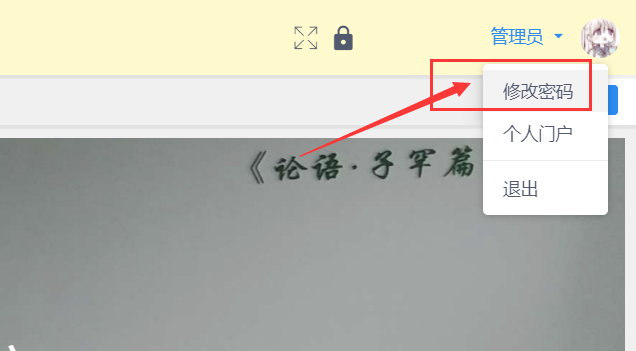

出现修改密码弹框，用户可以再次输入自己的新密码，完成账户密码修改。

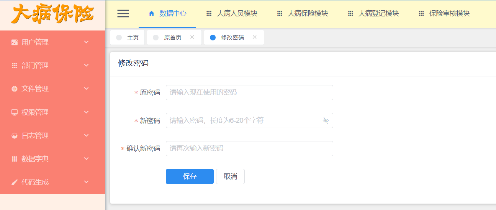

## 用户管理模块

登入成功后，有权限的用户可以进入登入用户管理模块。

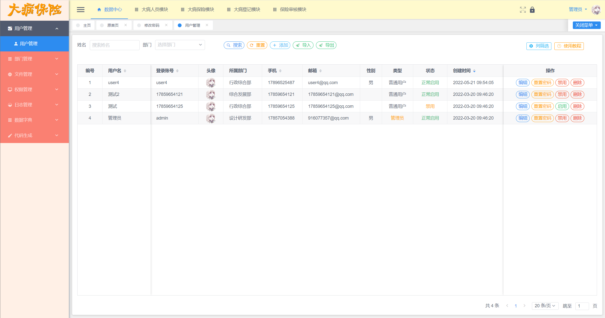

用户可以点击“添加用户”按钮，在弹框中完成用户的添加。

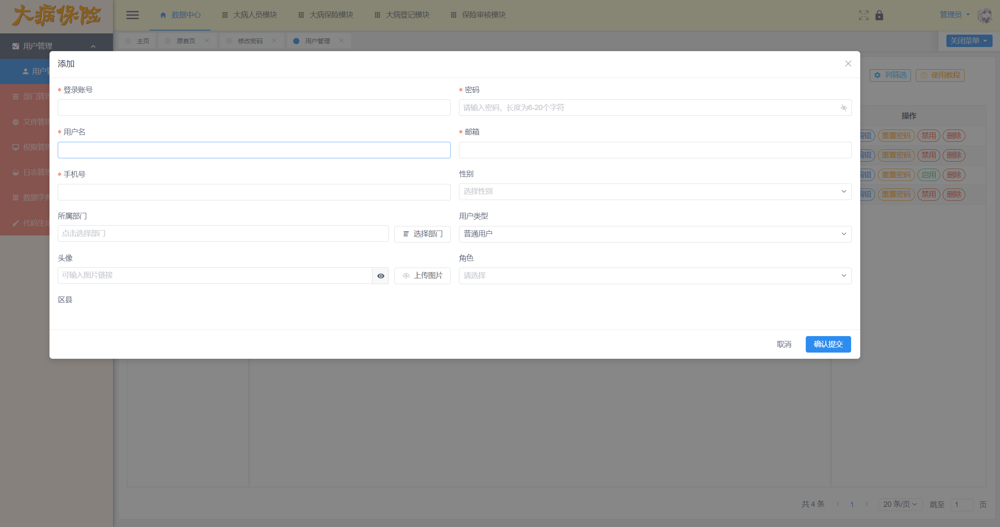

点击每一行的编辑按钮，可以对用户信息进行编辑。


点击每一行的启用/禁用按钮，可以对用户信息进行启用/禁用。

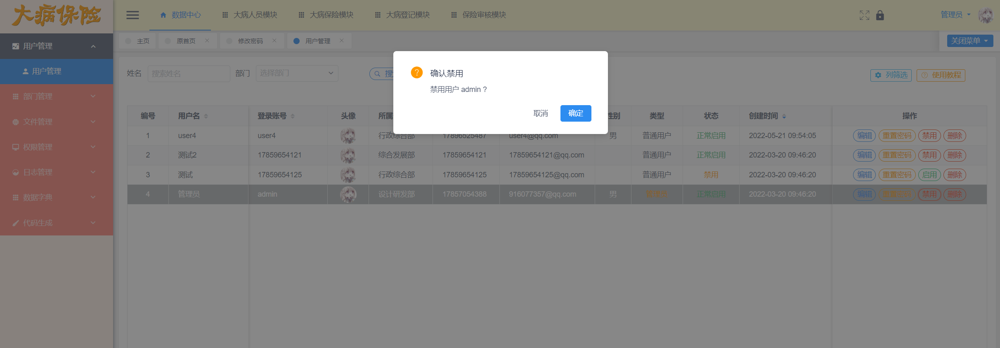

点击每一行的删除按钮，可以对用户进行删除操作。

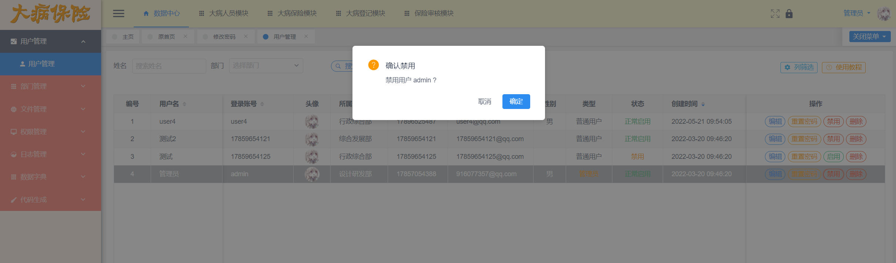

V1.1.0 新增部门和员工的对应模块

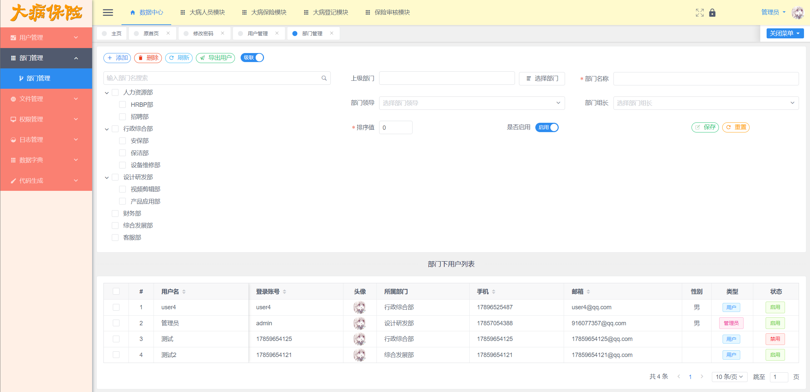

## 权限管理模块
系统管理包括登入用户、角色权限、系统菜单、数据字典等功能，主要功能为对系统的登入账户的信息维护。管理员可以根据需要对各个部分进行编辑。系统的用户管理模块负责维护系统登入用户的删改，前端将操作的数据通过 Axios 发送到后端的控制器层，后逐层深入操作底层数据库，再将返回结果给视图层渲染。管理员可以在该模块中对用户进行日常的维护工作。对于登入用户管理功能，管理员可以对用户的信息进行编辑、删除、禁用等操作；对于角色权限管理，管理员可以根据用户，选择对该用户进行添加或是删除某项权限。

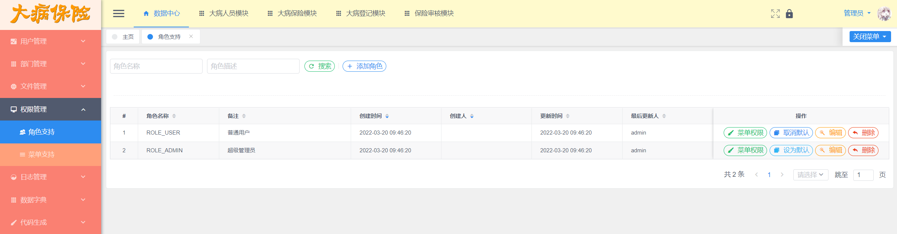

管理员可以点击“添加角色”按钮，完成角色的添加。

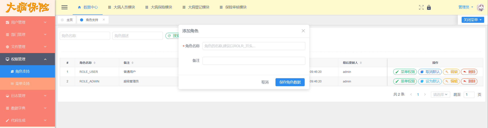

管理员可以点击每一行的“菜单权限”按钮，完成对角色的菜单权限分配。

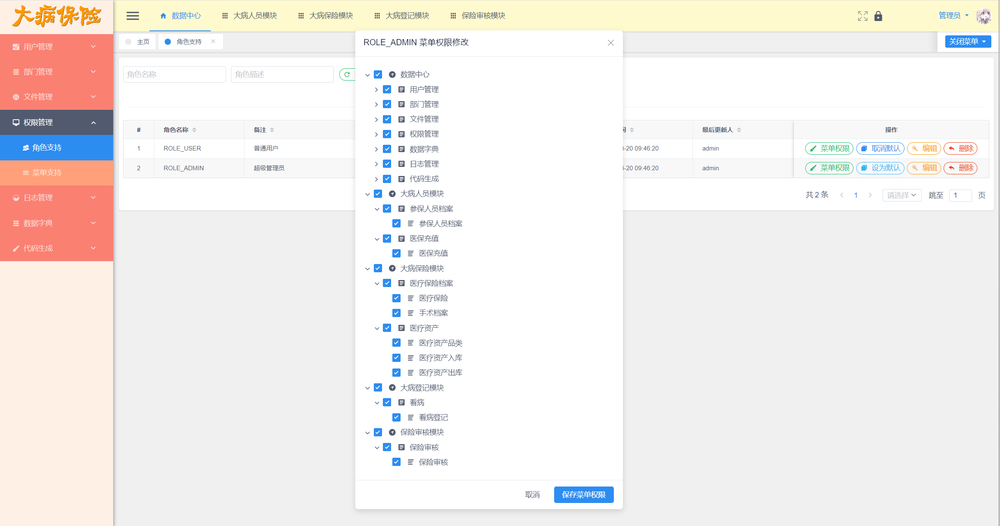

管理员可以点击每一行的“编辑”按钮，完成对角色数据的更新。

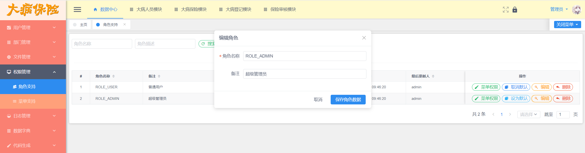

管理员可以点击每一行的“设置默认”按钮，将角色设置为默认角色，新用户自动会赋予该角色。


## 系统菜单模块

系统菜单模块用于控制系统菜单的代码位置、图表、模块名称等信息，该模块功能面向开发者。

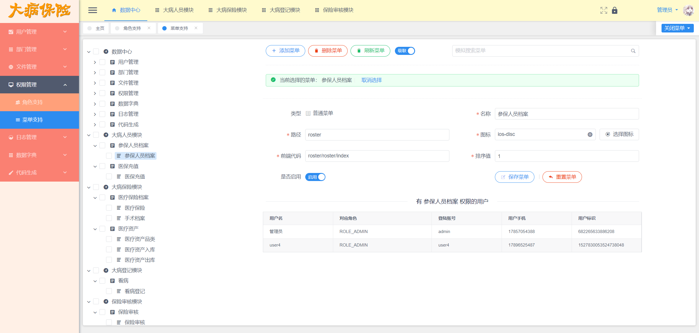

## 数据字典模块

该模块用户存放下拉框的常用数据，完成快捷开发。

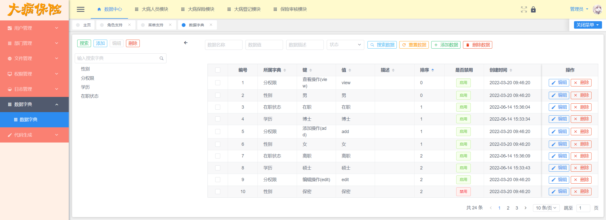

管理员可以添加数据字典，需要和代码中的字段进行匹配。

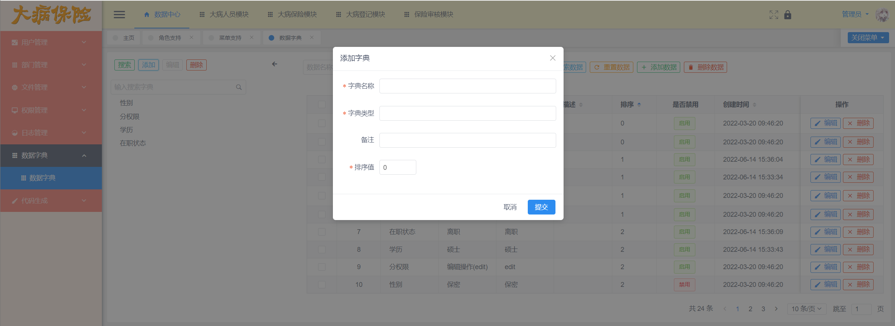

管理员可以对数据字典下的数据值进行编辑操作。

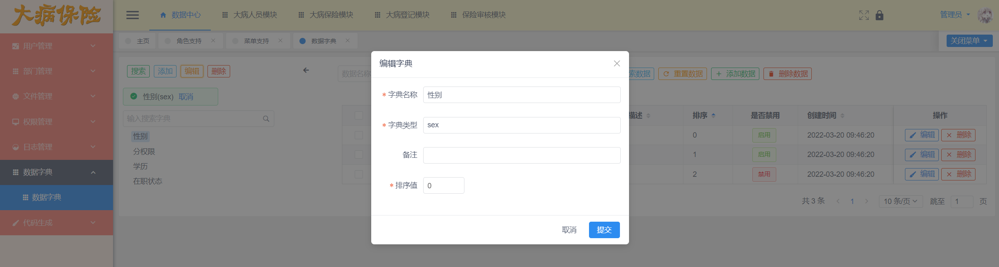

## 参保人员模块

参保人员档案包含了参保人员的信息，其中中间区域上部分含有添加、搜索、筛选功能按钮，下方显示参保人员的相关医保信息，下侧窗口为参保人员详细信息，点击参保人员，会将该参保人员的基础信息、社保情况、参保情况显示在该中间区域的下方，可对这些进行信息进行修改，包括基础信息的修改，社保情况的修改，参保情况的修改。

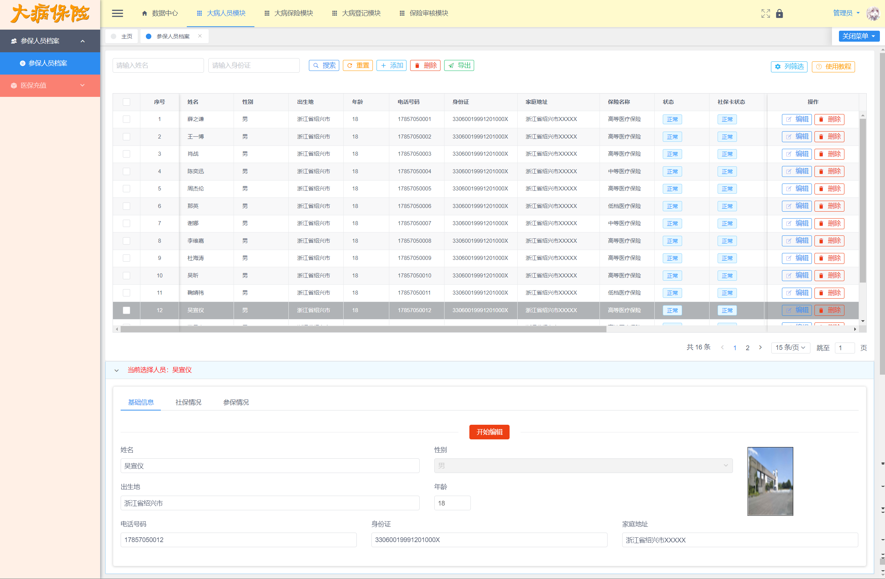

点击“添加人员”，则可以录入大病患者的基础信息，包括姓名、手机号、身份证号码、社保卡号、家庭住址、以及保险类型。然后点击“提交”则可以进行参保人员信息了录入

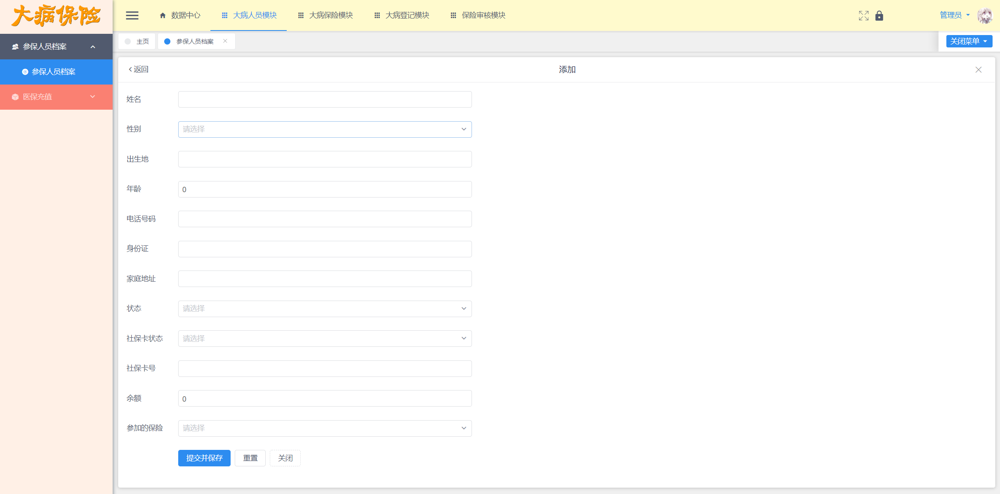

## 医保充值模块

医保充值界面中，同样包含了参保人的一些基本信息，如姓名、电话、身份证、社保卡及余额等，管理人员可以点击右侧的充值按钮给参保人员进行充值。

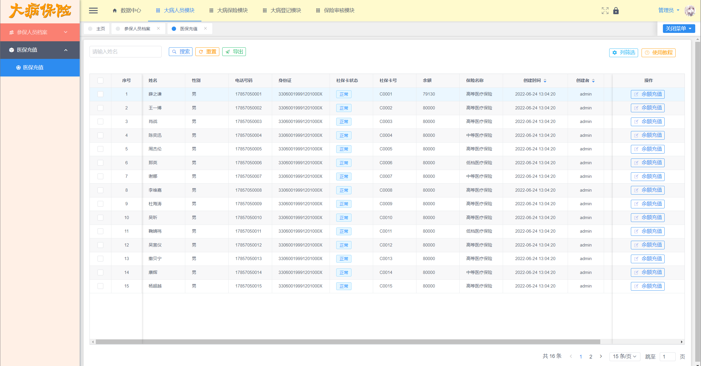

管理员可以点击每一行的充值按钮，完成医保卡的充值操作。
下面是模拟医保充值模块的实现，以上步骤已经讲需要参保人员信息录入了，但是医保卡里没有钱，无法进行看病报销。所以需要进行医保充值。选择需要充值的社保卡，点击后方“充值”按钮，弹出“医保充值”的框，输入充值价格就可以了。

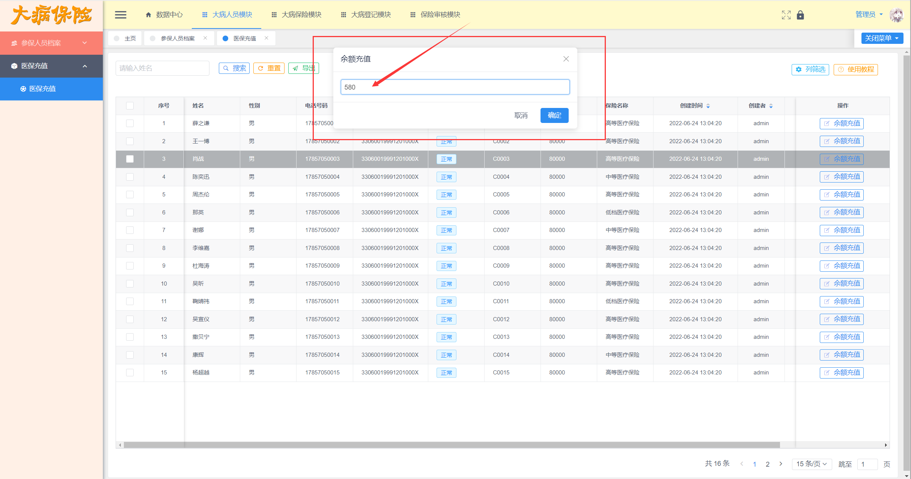

## 大病保险模块

大病保险模块是对保险手术相关的信息修改，所以该部分功能包括了医疗保险信息的修改和手术档案信息的修改。包括了最基本的对医疗保险信息和手术档案的增删改查，首先点击左侧的医疗保险或者手术档案即可链接到相应的界面，然后对相应的信息进行修改，例如如图 5-7 所示，当前页面为医疗保险的信息，在这个页面可以对医疗保险的信息继续修改，点击添加按钮即可添加医疗保险，登记保险名称，分类门诊百分比等，这些医疗保险信息分别都与后续其他模块如大病登记或是保险审核相干，这些信息都会影响到其他模块。手术档案部分同医疗保险部分的功能大体上相同，也包含相应的添加、搜索、编辑等，这里的设置同样能够影响到后续其它模块，这里的主要功能是对手术级别以及手术费用的设置，这样便与医疗保险的等级对应起来。

其中，保险名称有三种，分别是最低医疗保险、高档医疗保险、基本医疗保险，ABC 三类大病门诊百分比也不同。保险审核员可以对其进行编辑和删除。此模块是医保管理员进行操作的。

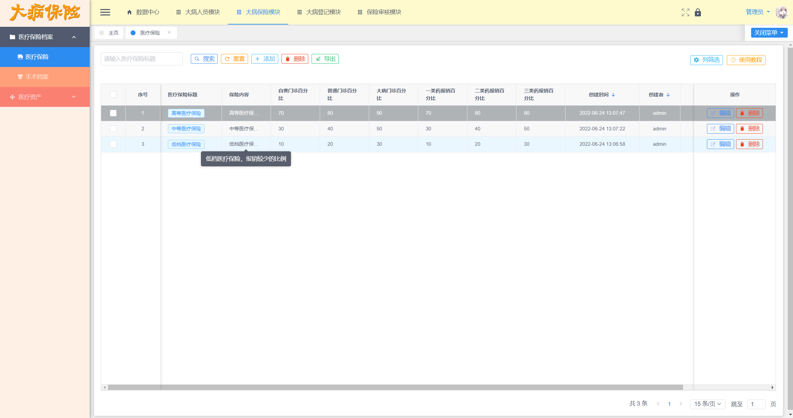

此外还有手术档案小模块，包括手术名称，手术价格，功能主治的介绍，以及手术类型，例如关节穿刺术，手术价格为 6750 元，对人体关键骨节进行复位的穿刺，属于一级手术，其中手术价格超过 5000 用红色字体突出渲染，小于等于 5000 的用绿色字体渲染。

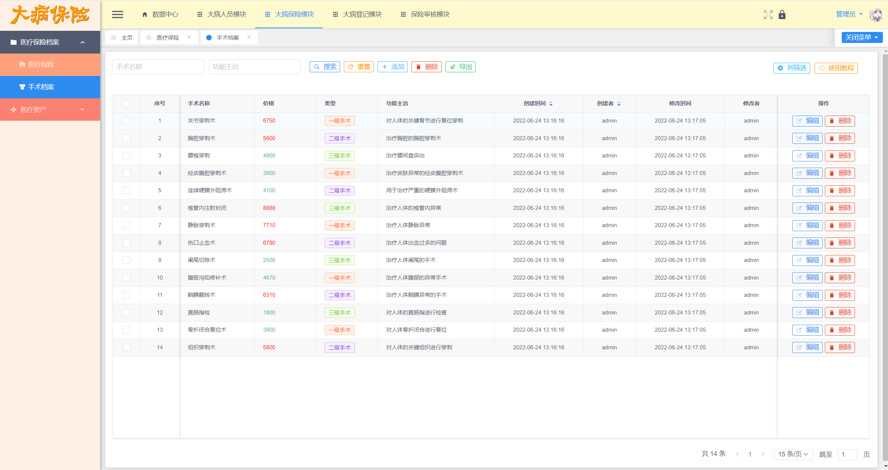

## 看病登记模块

大病登记模块包含了参保人员看病时的具体信息，该部分可帮助医疗相关工作者查看查找相关参保人员的就医信息，包括门诊的类型、费用总计以及看病的日期。如图 5-9 所示，当前页面为看病登记的信息，在这个页面可以对参保人员的就医信息进行查看，该模块也可对数据进行增删查功能，在查找部分，管理员可根据门诊的类型来选择患者查看患者。该模块可点击查看按钮即可进行更加详细的查看，例如手术类型，诊断费用，费用抵扣等。

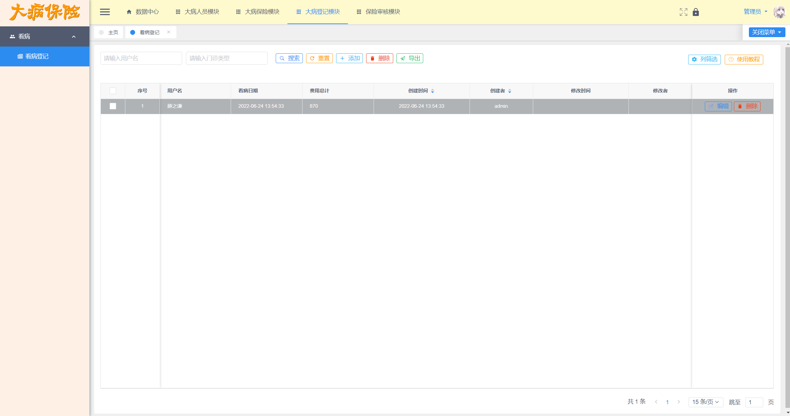

点击“添加”的按钮，可以为患者添加就医信息，弹出界面，如下图所示，选择“患者”、 “手术”以及“门诊类型”和“诊断原价”来进行添加。剩下的信息会自动带出，自动结算报销后的价格。

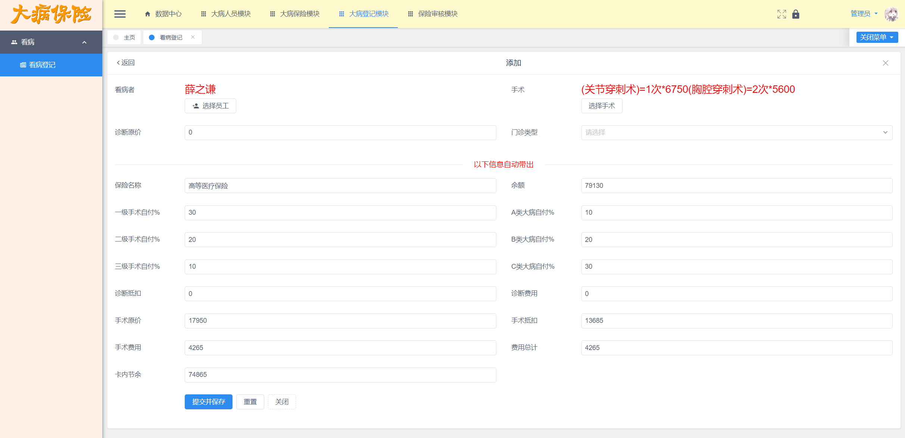

点击选择“选择患者”，弹出如下界面，该界面包含了参保人员的信息，包括姓名，联系电话，身份证号以及相关社保等信息，双击完成选择。

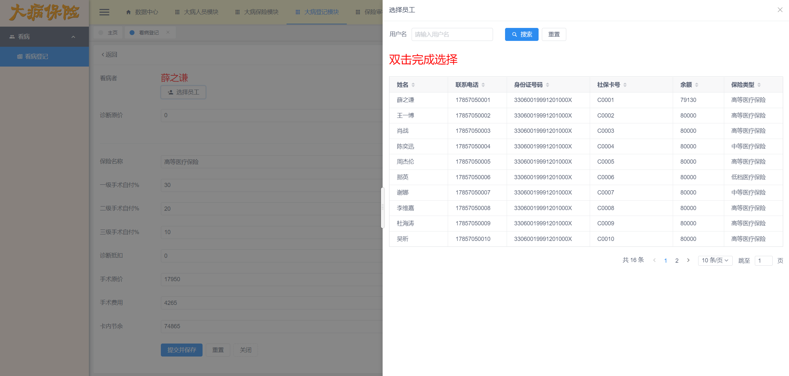

点击“选择手术”，可以选择需要导入档案的手术信息，点击手术并输入数量，选择“暂存”，“从手术档案导入”，即可添加手术。

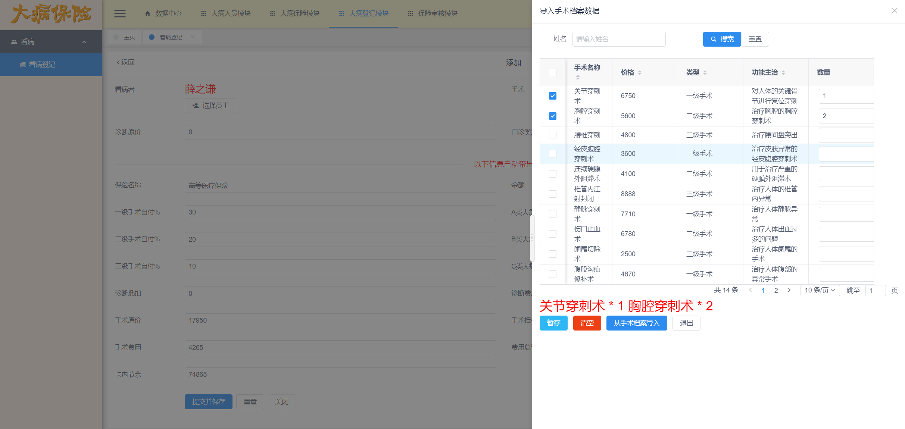

门诊类型根据设置来对不同的门诊类型进行选择，对应不同的自付比例，如下图所示。


输入“诊断原价”，例如输入“6000”，系统根据所选择的门诊类型的不同，计算不同的报销比，自动计算报销后的费用总计“1200”，最后点击“提交与保存”即可完成看病的档案登记。


## 保险审核模块

保险审核模块是相关工作人员对参保人员提出的大病保险相关的审核，所以该部分的功能主要是对参保人的保险审核。该部分同样包括了对参保人员的基础查找功能，该部分的最主要的功能是为了方便保险管理人员对参保人提出的保险抵扣进行审核，所以该部分为了便于相关保险工作者进行高效审核，在查找部分的时候，可以直接查找审核状态，提高审核的工作效率。在审核参保人员的信息准去无误后，相关保险工作者可以直接点击审核通过或选择不通过，并同时批注上不通过的理由。

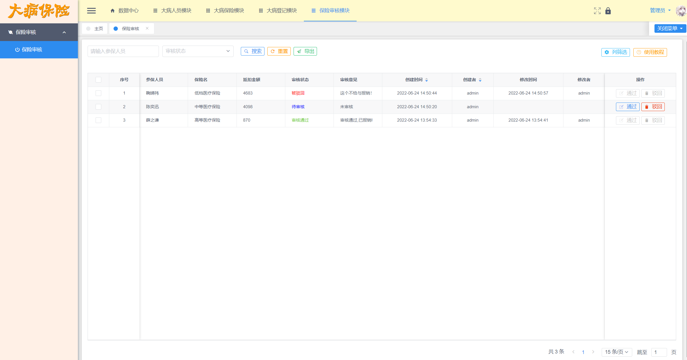

如果保险审核员对于申请的医保报销无法进行通过，则可以点击“退回”，输入退回的原因：该病不予报销，点击“确定”，则可以退回申请。

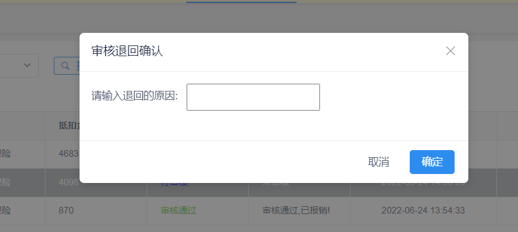

如果某个医保保险申请符合要求，则可以审核通过，点击“审核通过”按钮，再点击“确认”即可。

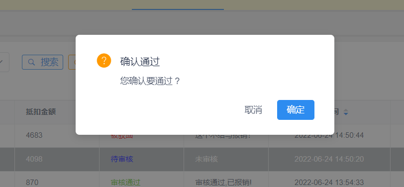

## 医疗设备档案模块【V1.1.0 新增】

医疗资产品类模块如下所示。

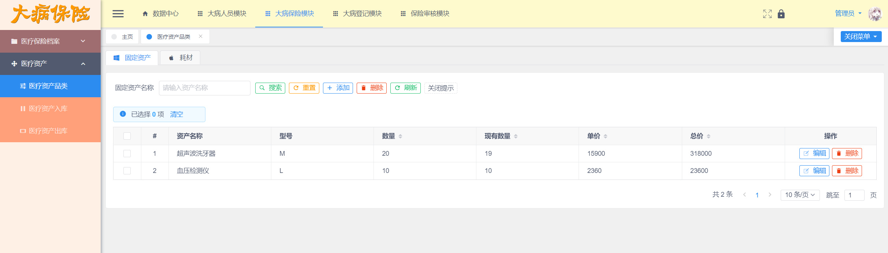

资料资产入库模块如下所示。

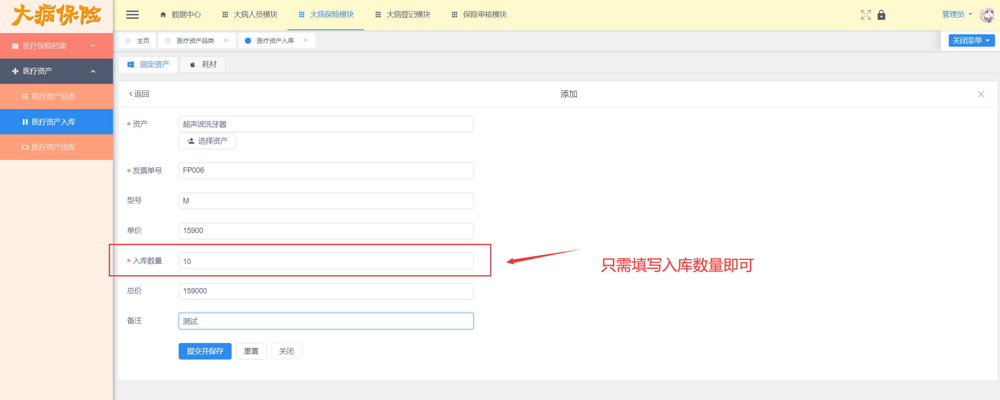

入库单主界面如下图所示。

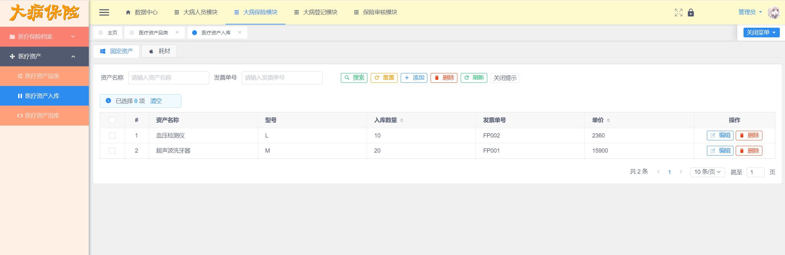

医疗资产出库操作界面如下图所示。

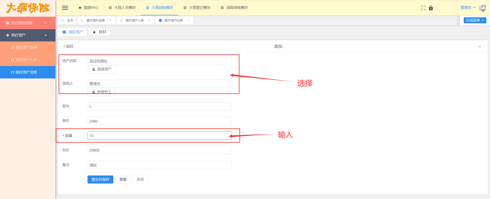

出库单主界面如下图所示。

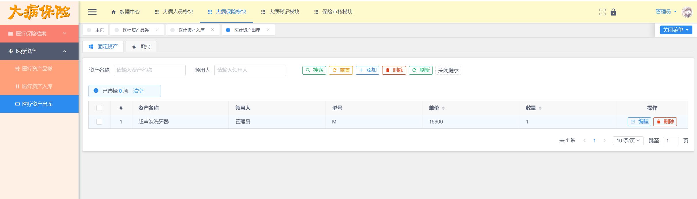


## 安装说明

1. 下载 Redis 安装文件，zip 压缩包即可。

2. 运行 Redis。即使用 cmd 窗口，进入到 redis 解压目录，输入 redis-server.exe redis.windows.conf 即可。出现下图所示界面则为运行成功。

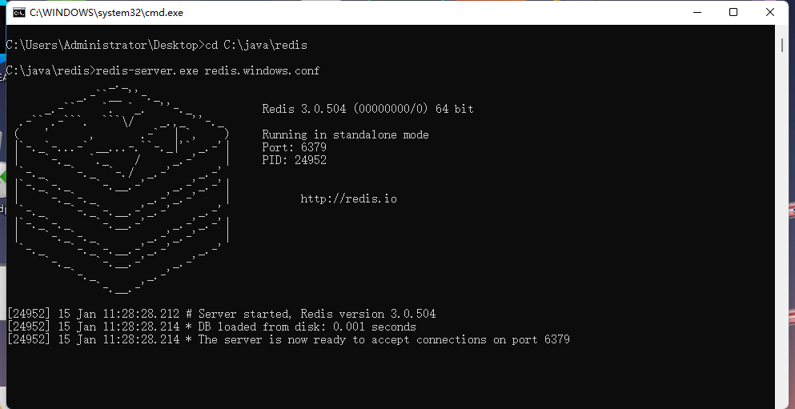

3. 使用 VsCode 打开前端项目目录，新建终端，输入 npm i 安装依赖，后输入 npm run dev 运行项目。

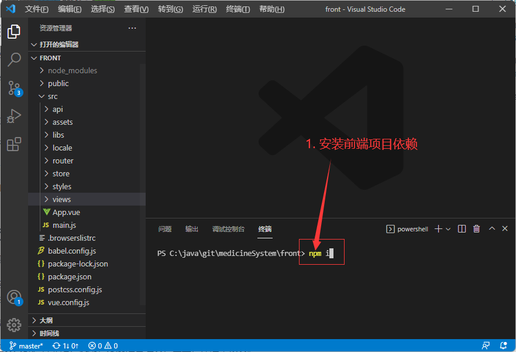

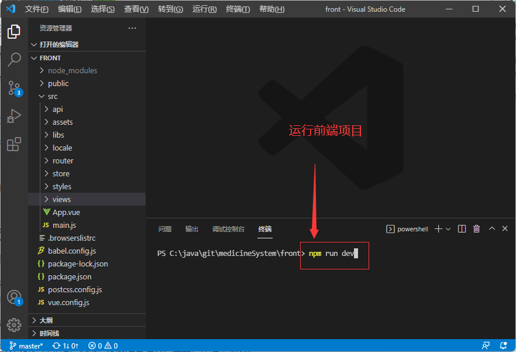

4. 使用 Idea 打开后端项目目录，检查 Maven 配置和 JDK 配置是否正常。

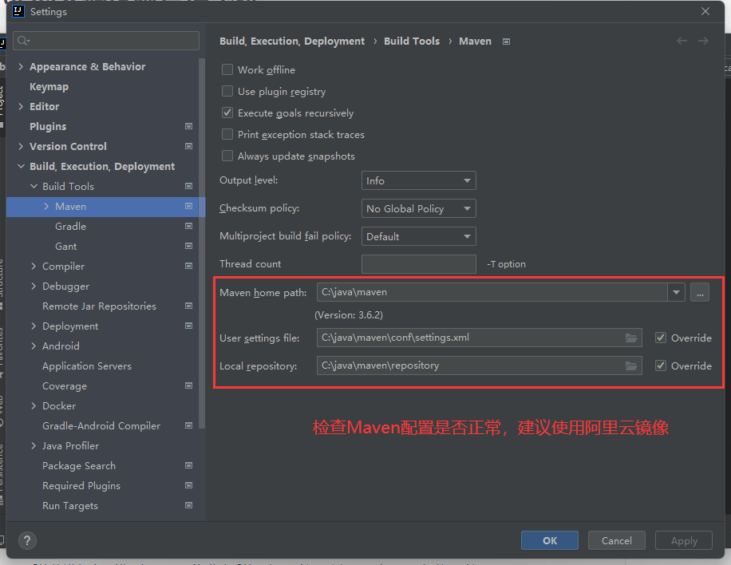

5. 检查后端数据库配置是否符合开发环境要求。

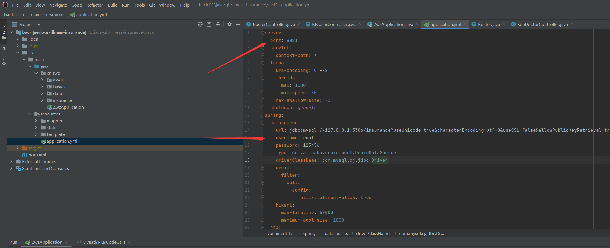

6. 启动后端项目。

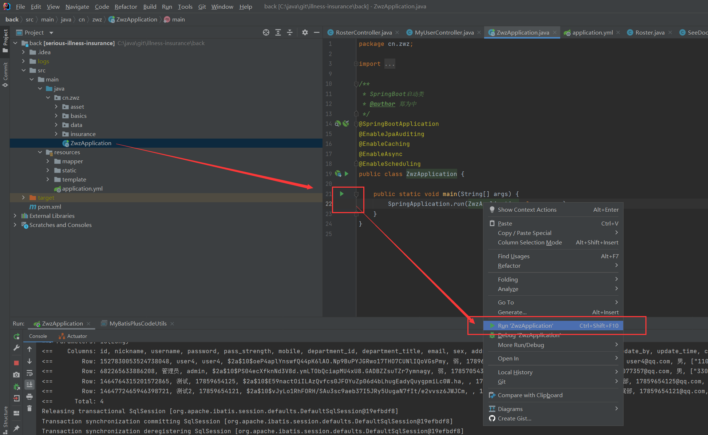

7. 打开浏览器，输入项目前端地址。

```java
http://localhost:8080/
```

## 说明

1. 本项目开源，仅供个人学习使用，遵循 GPL-3.0 开源协议，二次开发请注明原项目的来源。
2. 作者拥有本软件构建后的应用系统全部内容所有权及独立的知识产权。
3. 如有问题，欢迎在仓库 Issue 留言，看到后会第一时间回复。相关意见会酌情考虑，但没有一定被采纳的承诺或保证。

## 免责声明

下载本系统代码的用户，必须同意以下内容，否则请勿下载！

1. 出于自愿而使用/开发本软件，了解使用本软件的风险，且同意自己承担使用本软件的风险。
2. 利用本软件构建的网站的任何信息内容以及导致的任何版权纠纷和法律争议及后果和作者无关，作者对此不承担任何责任。
3. 在任何情况下，对于因使用或无法使用本软件而导致的任何难以合理预估的损失（包括但不仅限于商业利润损失、业务中断与业务信息丢失），作者概不承担任何责任。
4. 必须了解使用本软件的风险，作者不承诺提供一对一的技术支持、使用担保，也不承担任何因本软件而产生的难以预料的问题的相关责任。
